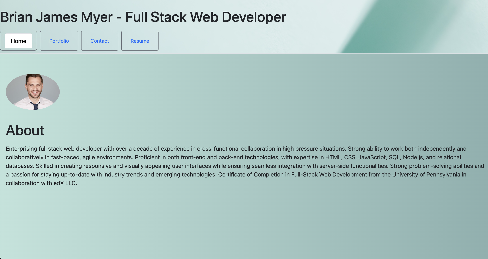

# Brian's React Portfolio 

## Description

This application is a portfolio created with React and deployed through Netlify in order to provide materials for potential job applications.

## Table of Contents

- [Installation](#installation)
- [Usage](#usage)
- [License](#license)
- [Contributing](#contributing)
- [Tests](#tests)
- [Questions](#questions)

## Installation

N/A

## Usage

Send along with job application and links to professional social networking profiles for prospective jobs.

## License

To know more about the MIT license please visit https://opensource.org/licenses/MIT.

## Contributing

N/A

## Tests

[Check out the deployed link here!](https://65132e4550ade203193dbf28--playful-melba-a46b39.netlify.app/)

## Questions

[Link to my GitHub profile](https://github.com/brianmyer)

Please email me at myer.brian@gmail.com for any further questions